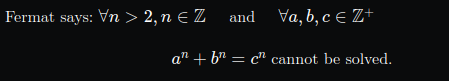

# <p align=center>MathJax Viewer</p>

It's no secret that the process of writing LaTeX notes is insufferable -- the entire document is reloaded for every change that is made, and small "typos" can yield stressing errors. Still, I have to, because it is, by far, the best way to document stuff. Since I did not want to ditch LaTeX and needed to preview my theorems and proofs in real time, thus, I've decided to create a simple web interface to assist writing mathematical equations.

This way, the user input is going to be only math, allowing for copy-pasting into a proper LaTeX math environment once the equation is finished.

## Usage
#### Input
```
Fermat says: \(\forall n > 2, n \in \mathbb{Z} \quad \) and \(\quad \forall a,b,c \in \mathbb{Z}^+\)
<br><br> <!-- HTML and math?! -->
<center>\(a^n + b^n = c^n\) cannot be solved.</center>
```
#### Output
<p  align="center">

</p>

## To-do
- [] Only allow secure HTML tags;
- [] Fix horizontal overflow from output box;
- [] #footer-credits writing animation;